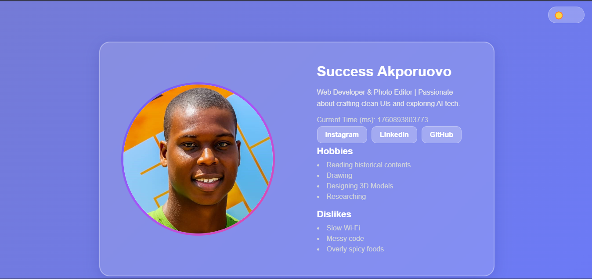
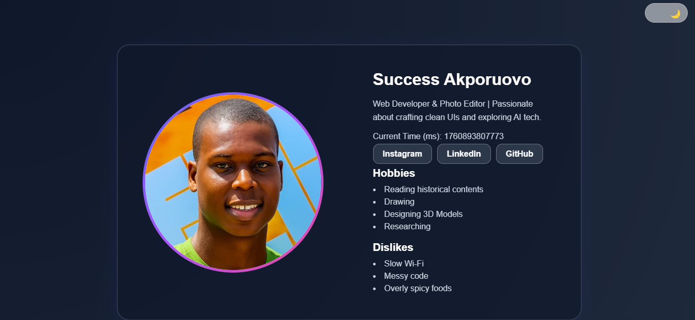

# Profile Card (by Success)

A clean, responsive, and testable **Profile Card project** built using plain **HTML, CSS, and Vanilla JavaScript**.  
It includes semantic and accessible design principles, a live time display, and a dynamic **light/dark mode toggle** for a modern user experience.


## Live Demo
 [View Live Project Here](https://success-profile-card-hng13.netlify.app/)

## Project Overview

This project was created as part of the **HNG13 Internship – Stage 0 Task**.  
The goal was to build a profile card component that is:
- Accessible 
- Responsive   
- Semantic   
- Testable via `data-testid` attributes   

## Features

 **Semantic HTML5 Structure** – Uses proper elements like `<article>`, `<section>`, `<nav>`, and `<figure>`  
 **Accessibility Ready** – Includes alt text, focus states, and keyboard navigation  
 **Live Clock in Milliseconds** – Updates automatically using `Date.now()`  
 **Light/Dark Mode Toggle** – Allows users to switch themes seamlessly  
 **Responsive Layout** – Optimized for mobile, tablet, and desktop  
 **Social Links Section** – Opens safely in a new tab (`target="_blank"` + `rel="noopener noreferrer"`)  
 **Personal Details** – Displays avatar, bio, hobbies, and dislikes dynamically  

## Preview



## Tech Stack

- **HTML5**
- **CSS3 (Flexbox + Media Queries)**
- **Vanilla JavaScript (ES6)**

## ⚙️ How to Run Locally

1. Clone this repository:
   ```bash
   git clone https://github.com/Succex7/profile-card.git
